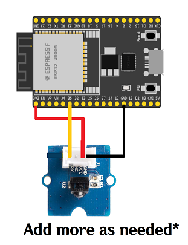
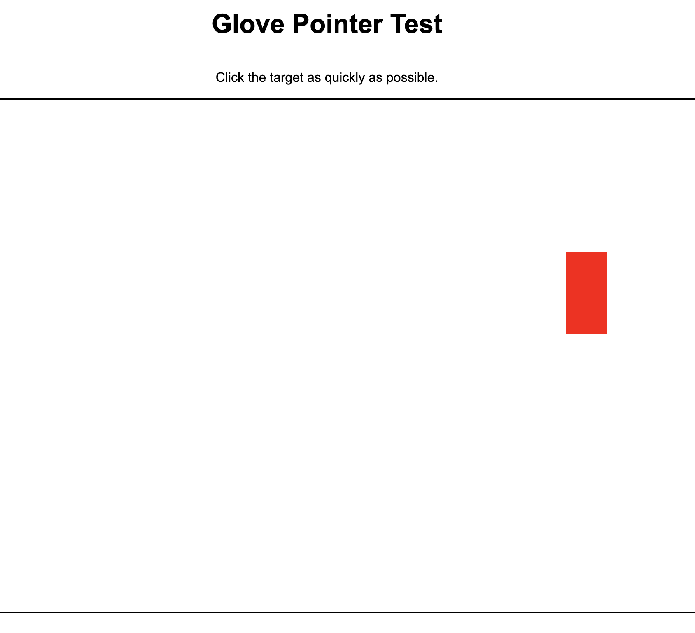

# Glove-Based Pointing and Clicking Device Using Arduino (MPU6050 Accelerometer and Gyroscope-based Sensor; HMC5883L Magnetometer)

#### Device Overview
The proposed device is a microcontroller-based prototype, leveraging a sensor as its input device. Affixed to a glove, it relies on hand movements as its main source of input. This allows for non-in-person manipulation of the mouse pointer, allowing users to move the pointer and select targets. Apart from this, IR receivers are also set up at certain positions, translating to respective positions on the screen. These are used to communicate pointing positions of the glove, and will generally transport the pointer to the respective location once activated. The triggers are communicated via Bluetooth.
### Firmware
The firmware is implemented in Arduino that uses processed motion input from the MPU6050 sensor to control the mouse cursor on a connected device. The Inter-Integrated Circuit (I2C) Device Library is the main library used for this implementation. It is a library that simplifies communication between devices that use the I2C protocol, a serial communication and bus interface connection protocol to connect multiple devices through a shared bus. This is referenced from [I2C Dev Library](https://github.com/jrowberg) of Jeff Rowberg. Additionally, the [Adafruit HMC5883L](https://github.com/adafruit/Adafruit_HMC5883_Unified) from Adafruit was used to interface the magnetometer. 

### Guidelines when Running the Program
#### Glove Program
1. Open [../code with libraries/gyro_mouse](https://github.com/fir3yice/Glove-Based-Pointing-Device/tree/main/code%20with%20libraries/gyro_mouse) folder using the Arduino IDE.
2. Import the mouse library using the built-in library manager, along with the Adafruit HM58883 library. Install any dependencies when prompted.
3. Upload to Arduino Pro Micro. 
*Note: Ensure that the correct COM port and board are selected.*
#### IR Receiver Program
1. Open [../code with libraries/esp32_test_2](https://github.com/fir3yice/Glove-Based-Pointing-Device/tree/main/code%20with%20libraries/esp32_test_2) with the Arduino IDE
2. Install the ESP boards from Espressif
3. Upload to ESP32-Wroom board. Make sure to hold the reset button when uploading (inherent hardware requirement). 
*Note: Ensure that the correct COM port and board are selected.*

### Hardware Used
To build the prototype, hardware components include an Arduino Pro Micro, an MPU-6050 sensor, breadboards, and male-to-male cables, HM58883L, TTP223 Touch Sensors, IR Transmitter, IR Receivers, and an ESP32-WROOM.
 

### Testing Interface
To assess the effectiveness of the proposed prototype, a general purpose testing facility that simulates simple computer navigation and target selection ws created through an HTML page. This may be loaded through the **task_ver4.html** file.

Once users start the session, they will need to accomplish 5 trials of clicking on the red target. These targets are generally randomly generated, though some overlaps may occur due to minor bugs in the file. 

### Analysis Conducted
The analysis notebook of the data is available in the **analysis.ipynb** file. The raw data is available in [../data](https://github.com/fir3yice/Glove-Based-Pointing-Device/tree/main/data). Parsing the data can be seen in the notebook, where DataFrames are created for each subdirectory in the data folder, features are engineered, and models are created. 